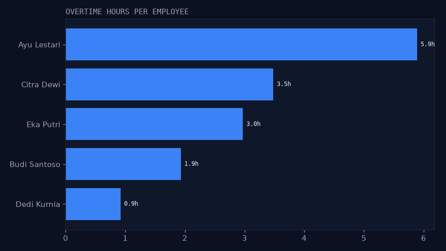
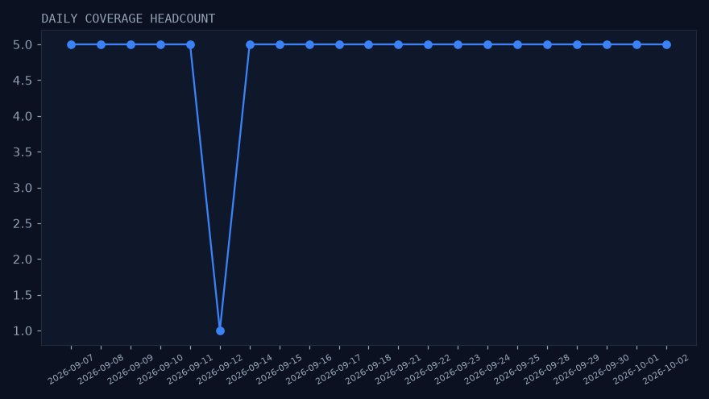
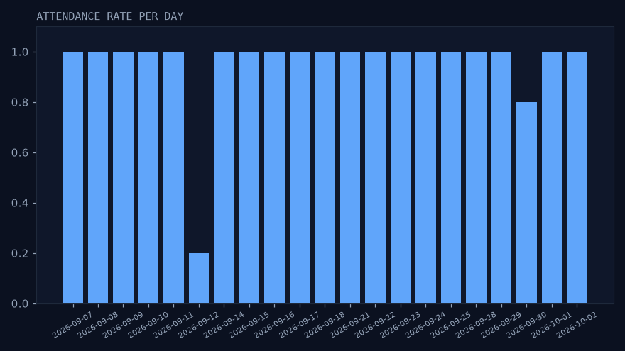
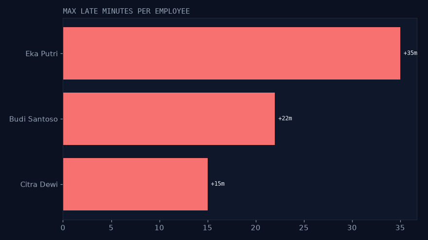
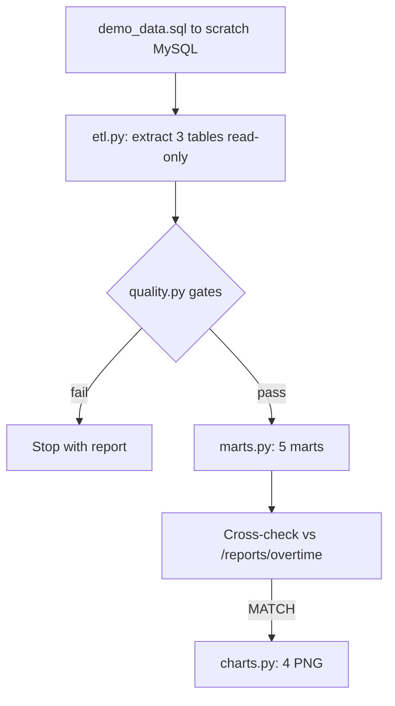

# shiftbase-data

[](https://github.com/RakhaYandra/shiftbase-data/actions)

> Ekosistem: [api](https://github.com/RakhaYandra/shiftbase) · [web](https://github.com/RakhaYandra/shiftbase-web) · [docs](https://github.com/RakhaYandra/shiftbase-docs/releases) · [qa](https://github.com/RakhaYandra/shiftbase-qa) · [data](https://github.com/RakhaYandra/shiftbase-data) · [ops](https://github.com/RakhaYandra/shiftbase-ops)

Pipeline analitik HR untuk database [Shiftbase](https://github.com/RakhaYandra/shiftbase) —
Python + pandas + DuckDB + matplotlib. Tanpa server, tanpa deploy.

## Purpose, Output & Expectations

**Purpose.** Shift records alone don't tell a manager who is overworked,
which days are understaffed, or who is chronically late. This pipeline turns
shifts + attendance into those answers — and cross-checks overtime against
the API itself.

**Output.** Deterministic demo data (101 shifts + 101 attendance with
overtime/late cases), 5 marts, 4 charts, and a MATCH cross-check between
pipeline overtime and `GET /v1/reports/overtime`.

**Expectations.** After `./run.sh`: same numbers on every fresh DB; pipeline
and API agree within rounding; no dumps or credentials committed.

## Features

| Feature | Description |
|---|---|
| Demo data | - Committed `demo_data.sql`: 4 weeks, 5 staff, overtime/late/edge cases (rejected conflicts proven via API, not data). - Purpose: transparent fixture. Output: reviewable rows. |
| Extract + quality | - Read-only MySQL read; gates for orphan FKs, check_out ≤ check_in, end ≤ start, broken uniques. - Purpose: trustworthy input. Output: quality report. |
| Marts | - `hours_daily`, `overtime_employee`, `coverage_daily`, `attendance_rate`, `late_arrivals`. - Purpose: HR answers. Output: 5 marts. |
| Cross-check | - Pipeline overtime vs API overtime must MATCH (< 0.01). - Purpose: two implementations, one truth. Output: MATCH line. |
| Charts | - 4 PNGs (overtime, coverage, rate, late). - Purpose: visuals without deploy. Output: committable PNGs. |

## Insight (run demo_data Sep-Okt 2026)

* **Lembur top: Ayu Lestari 5,9 jam** (2 shift 11 jam); Citra 3,5h; Eka 3,0h; Budi 1,9h; Dedi 0,9h
* **Cross-check vs API identik**: overtime pipeline = `GET /v1/reports/overtime`
  (rumus sama: `GREATEST(jam-8,0)` per hari; selisih < 0,01 pembulatan)
* **Telat max: Eka Putri +35 mnt** (21 Sep); ambang telat > 5 menit
* **Coverage min 1 orang** (Sabtu 12 Sep, shift Ayu saja)






## Cara run 10 menit

```bash
# 1. MySQL scratch + migrate + seed + demo
docker run --rm --name sb-data-mysql -e MYSQL_ROOT_PASSWORD=rootpass \
  -e MYSQL_DATABASE=shiftbase_data -e MYSQL_USER=shift -e MYSQL_PASSWORD=shiftpass \
  -p 13307:3306 -d mysql:8.4
goose -dir ../shiftbase/migrations mysql \
  "shift:shiftpass@tcp(127.0.0.1:13307)/shiftbase_data?parseTime=true" up
# seed + demo_data.sql via mysql client (lihat runbook di bawah)

# 2. API opsional (untuk cross-check): :18092 vs DB yang sama
# 3. Pipeline
pip install -r requirements.txt
./run.sh
```

Kredensial via env (`SB_HOST/PORT/USER/PASS/DB`, default throwaway lokal).
`demo_data.sql` deterministik (101 shift + 101 absensi, kasus lembur/telat;
konflik-ditolak dibuktikan via API, bukan data).

## Struktur

```
demo_data.sql  # sumber demo ter-commit (transparan, fiktif)
etl.py         # extract read-only (pymysql)
quality.py     # gates: orphan FK, check_out<=check_in, end<=start, duplikat unik
marts.py       # 5 marts -> DuckDB + parquet (work/)
charts.py      # 4 PNG gaya Nexus
run.py         # orkestrasi + cross-check API + insight
```

## Verifikasi

* `work/quality_report.json` — 0 errors
* Cross-check overtime pipeline vs API: MATCH
* Deterministik: DB fresh → angka sama

## How It Works


